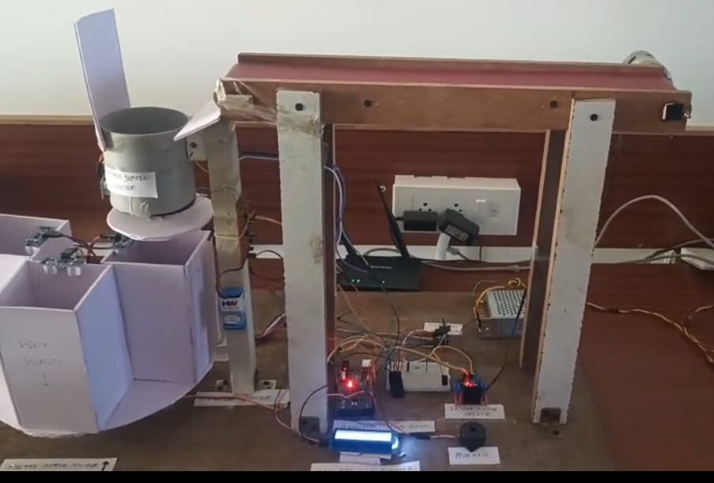
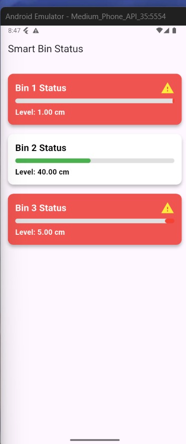
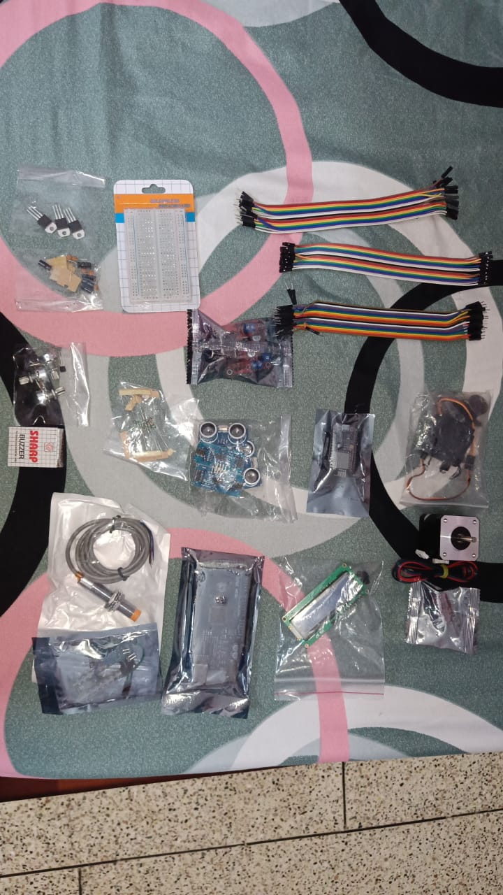
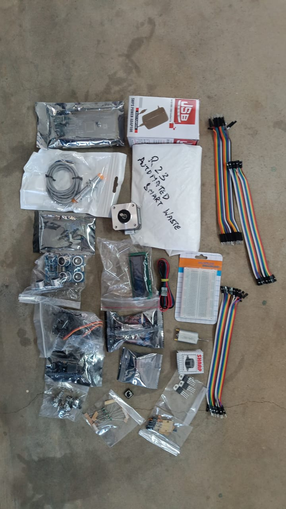

# Automated Smart Waste Segregation System with Live Monitoring and Intelligent Bin Alerts

Final Year B.Tech Project — Electronics & Communication Engineering
Aditya College of Engineering & Technology (A), 2021–2025

An embedded IoT system that automatically detects and sorts waste into **metal**, **plastic/dry**, and **wet (biodegradable)** categories using a sensor-driven conveyor belt, then monitors bin fill levels in real time and sends push notifications via a mobile app.

🔗 **[View interactive circuit simulation on Tinkercad](https://www.tinkercad.com/things/g9d7AGF8vgo-amazing-fulffy)**

---

## Gallery

| Prototype | Mobile App |
|---|---|
|  |  |

<details>
<summary>Component kit (click to expand)</summary>




</details>

---

## Overview

Manual waste segregation is slow, inconsistent, and exposes workers to health risks. This project automates the process end-to-end:

1. Waste is placed on a conveyor belt (12V DC motor + L298N driver).
2. A **moisture sensor** and **custom inductive metal sensor** classify the item as it reaches the detection zone.
3. An **HC-SR04 ultrasonic sensor** detects when an item has reached the end of the belt and halts it.
4. A **NEMA17 stepper motor** + **MG995 servo** rotate the bin platform to align the correct bin, and the item is released.
5. Each bin has its own ultrasonic sensor for fill-level monitoring.
6. An **ESP8266 NodeMCU** streams bin levels to **Firebase Realtime Database** and fires a **Firebase Cloud Messaging** push notification when a bin is nearly full.
7. A **16x2 I2C LCD** shows live system status; a buzzer gives local audio alerts.
8. A Flutter mobile app displays live bin status and notifications.

## System Architecture

```
 Power supply ──┐
                │
 Moisture ──────┤
 Metal    ──────┼──▶  Arduino Mega  ──▶ Motor Driver ──▶ Conveyor Motor
 Ultrasonic ────┤            │
                │            ├──▶ 16x2 I2C LCD
                │            └──▶ Stepper + Servo (bin rotation)
                │
                └──▶ ESP8266 NodeMCU ◀──▶ Firebase ◀──▶ Mobile App (Flutter)
```

## Repository Structure

```
Smart-Waste-Segregation-System/
├── README.md
├── LICENSE
├── .gitignore
│
├── docs/                          # Project report, IEEE-style paper, PPT
│   ├── Project_Report.pdf
│   ├── Research_Paper.pdf
│   └── Project_Presentation.pptx
│
├── firmware/
│   ├── arduino_mega/
│   │   └── arduino_mega.ino       # Sensor fusion, sorting logic, motor/LCD control
│   └── esp8266_nodemcu/
│       ├── esp8266_nodemcu.ino    # Bin monitoring, Firebase + FCM
│       └── secrets.h.example      # Copy to secrets.h and fill in your credentials
│
├── hardware/
│   └── bill_of_materials.md       # Components list with specs
│
├── mobile-app/                    # Flutter app source (add when available)
│
└── images/                        # Prototype photos, circuit diagrams, screenshots
```

## Hardware Used

| Component | Purpose |
|---|---|
| Arduino Mega 2560 | Main controller — sensors, motors, LCD |
| ESP8266 NodeMCU | Wi-Fi, Firebase sync, push notifications |
| YL-69 Moisture Sensor | Detects wet/biodegradable waste |
| Custom inductive coil sensor | Detects metallic waste |
| HC-SR04 Ultrasonic Sensor (×4) | End-of-belt detection + bin fill levels |
| NEMA17 Stepper Motor + A4988 driver | Rotates bin platform |
| MG995 Servo Motor | Waste release mechanism |
| L298N Dual H-Bridge Driver | Conveyor DC motor control |
| 16x2 I2C LCD | Live status display |
| 12V 5A SMPS | System power supply |
| Buzzer | Local audio alerts |

Full specifications are in [`hardware/bill_of_materials.md`](hardware/bill_of_materials.md) and [`docs/Project_Report.pdf`](docs/Project_Report.pdf) (Chapter 3).

## Software & Services

- **Arduino IDE** (C/C++) — firmware for both microcontrollers
- **Firebase Realtime Database** — bin-level data store
- **Firebase Cloud Messaging (FCM)** — push notifications
- **Flutter** — mobile app for live monitoring

## Getting Started

### 1. Firmware — Arduino Mega
Open `firmware/arduino_mega/arduino_mega.ino` in the Arduino IDE, install the `LiquidCrystal_I2C` and `Servo` libraries, select **Arduino Mega 2560** as the board, and upload.

### 2. Firmware — ESP8266 NodeMCU
```bash
cd firmware/esp8266_nodemcu
cp secrets.h.example secrets.h
# edit secrets.h with your Wi-Fi + Firebase + FCM credentials
```
Install `FirebaseESP8266` and `ArduinoJson` libraries, select your NodeMCU board, and upload.

> ⚠️ **Never commit `secrets.h`.** It's already listed in `.gitignore`. The original project code had live credentials hard-coded — those have been moved out for this public repo.

### 3. Mobile App
Add your Flutter project under `mobile-app/` once ready to publish it.

## Results

The prototype reliably classified and sorted metal, plastic, and wet waste, updated bin levels every 3–5 seconds, and delivered FCM alerts when a bin crossed the "almost full" threshold. See `docs/Project_Report.pdf` (Chapter 6) for detailed test results and photos.

## Future Scope

- AI/CNN-based waste classification via camera module
- Solar-powered operation for off-grid deployment
- Web dashboard for municipal/multi-bin monitoring
- Edge inference on ESP32 to reduce cloud dependency
- Automatic bin-cleaning mechanism

## Team

| Name | Roll No. |
|---|---|
| D. Siddu Maheswara Rao | 21MH1A04E1 |
| J. Sri Sai Durga Veerendra | 21MH1A0425 |
| K. Sai Veerendra Vasu | 21MH1A0430 |
| P. Satya Krishna | 21MH1A0453 |

**Guide:** Mr. P. Ramesh, M.Tech, Ph.D, Assistant Professor, Dept. of ECE
**Institution:** Aditya College of Engineering & Technology (A), Surampalem

## References

Full reference list is in [`docs/Research_Paper.pdf`](docs/Research_Paper.pdf) and [`docs/Project_Report.pdf`](docs/Project_Report.pdf).

## License

This project is released under the MIT License — see [LICENSE](LICENSE).
